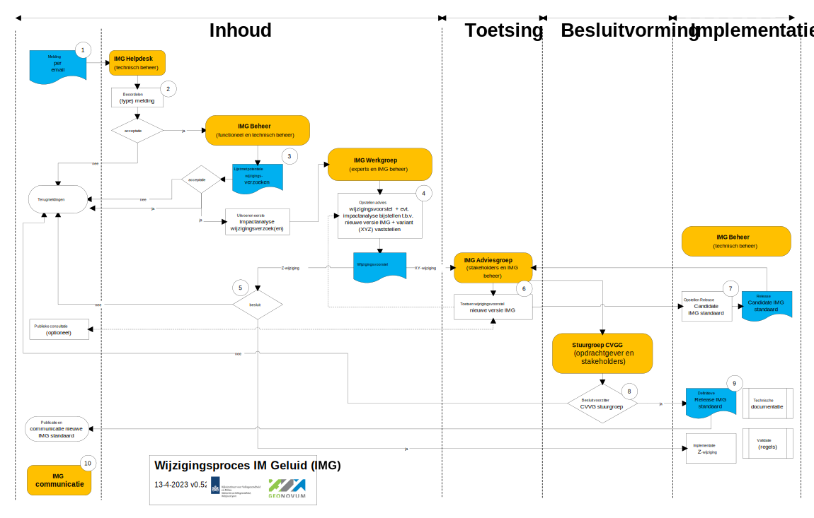

## Wijzigingsproces

De aanleiding voor een wijzigingsproces is gebaseerd op meldingen over de wensen en gevonden fouten in het informatiemodel Geluid. Dit zijn de wijzigingsverzoeken. Deze verzoeken worden door de Helpdesk in behandeling genomen en in samenwerking met de gebruikers en deskundigen (experts) en andere stakeholders verwerkt tot een wijzigingsvoorstel. De beheerder neemt het initiatief om een wijzigingsproces te starten, de stappen in het proces zijn conform het wijzigingsprotocol.

### Fasen in het wijzigingsproces

Het volledige wijzigingsproces doorloopt de fasen Inhoud, Toetsing, Besluitvorming en Implementatie, zoals weergegeven in <a href='#_Ref503260625'>Figuur 1.

<figure style="width: 35%;">

</img>

<figcaption>Fasen wijzigingsproces</figcaption>

</figure>

<b>Inhoud</b>

In de fase inhoud wordt voor ieder wijzigingsverzoek bepaald of deze wordt opgenomen in de nieuwe versie van de standaard of niet. Dit wordt door de **IMG helpdesk** intern vastgelegd en is raadpleegbaar via de <a href='(https://www.geonovum.nl/geo-standaarden/meldingen)' target='_blank'>website</a>. Voor ieder wijzigingsverzoek dat wordt meegenomen in de nieuwe versie van de standaard, wordt een impactanalyse uitgevoerd en oplossingen uitgewerkt. Deze eerste impactanalyse beoordeelt ook  tot welke SemVer categorie de wijziging hoort, welke betrokken partijen geraakt worden door de wijziging en wat de secundaire effecten van de wijziging zijn (e.g. er ontstaan extra validatieregels in het CVGG). 

Wanneer tijdens de eerste impactanalyse is vastgesteld dat het om een X of Y wijzigingverzoek gaat, wordt een **IMG werkgroep** ingepland met de deskundigen en stakeholders (indieners van het wijzigingsverzoek). Afhankelijk van de omvang van de wijziging ten opzichte van de voorgaande versie en afhankelijk van welke stakeholders geraakt worden door de wijziging, verandert de samenstelling van de **IMG werkgroep**. De werkgroep wordt vooraf geïnformeerd over het wijzigingsvoorstel en indien mogelijk wordt een eerste probleemschets en oplossing aangedragen voorafgaand aan de werkgroep door het technisch beheer. De resultaten van de werkgroep worden in een wijzigingsvoorstel voorgelegd aan de **IMG adviesgroep**.

<b>Toetsing</b>

De fase Toetsing vormt een brug tussen de inhoud en besluitvorming. In deze fase wordt voor een X of Y wijziging door de **IMG adviesgroep** het wijzigingsvoorstel getoetst en van een advies voorzien voor besluitvorming. Met deze consultatie vragen wij de gebruikers en stakeholders van de IMG standaard actief hun reactie te geven op het wijzigingsvoorstel. Het wijzigingsvoorstel inclusief de terugkoppeling uit een evt. publieke  consultatie wordt verwerkt als Release Candidate van het Informatiemodel Geluid.

<b>Besluitvorming</b>

Bij Besluitvorming wordt besloten om de gewijzigde IMG standaard vast te stellen en te publiceren. Afhankelijk van het type wijzigingsvoorstel (X, Y of Z, zie paragraaf <a href='#_Ref482110995'>proces varianten), besluit de voorzitter van de stuurgroep CVGG voor X en Y wijzigingen en het beheeroverleg voor de Z wijzigingen.

<b>Implementatie</b>

Het in gebruik nemen van de nieuwe IMG standaard in de praktijk staat centraal in deze fase. Hiervoor levert het **Technisch beheer** verschillende technische bestanden op. De technische bestanden zijn bijvoorbeeld testbestanden. Deze bestanden ondersteunen bij de implementatie van de standaard in de software. Beheerders van de CVGG nemen het nieuwe informatiemodel Geluid in gebruik. Het functioneel en technisch beheer ondersteunt de implementatie bovendien door de werking van het informatiemodel toe te lichten tijdens bijvoorbeeld bijeenkomsten of 'inloopspreekuren' voor de gebruikers en software leveranciers. Resultaat van deze fase is dat de gebruikers geluidsgegevens kunnen maken en uitwisselen conform de nieuwe IMG standaard. In <a href='#tussentijdse-werkafspraken'>Hoofdstuk 5 lichten we de implementatie verder toe.

### Het wijzigingsproces in detail

De meldingen en wijzigingsverzoeken alsook (inter)nationale ontwikkelingen geven aanleiding tot de verdere ontwikkeling voor een standaard. Het wijzigingsproces dat dit wijzigingsvoorstel doorloopt bestaat uit tien stappen, die in onderstaande Figuur 2 in onderlinge samenhang zijn weergegeven. In deze figuur zijn processen, besluiten en de relevante actoren en actorgroepen en hun interacties opgenomen. Iedere processtap is vervolgens kort beschreven.

<figure id="Figuur_x">

<figcaption>Processchema wijzigingsbeheer IM Geluid</figcaption>
</figure>

**Processtappen**

De volgende processtappen worden doorlopen om te komen tot wijzigingen in de IMG standaard (zie ook figuur 2): 

1. Met een ‘melding’ begint het wijzigingsproces. Doorgaans zal de gebruiker van het informatiemodel een eis of wens indienen, maar het kan ook het functioneel of technisch beheer zijn in sommige gevallen (bijv. wanneer een onderliggende standaard is bijgesteld). Er zijn meerdere ‘triggers’, die kunnen leiden tot het indienen van een wijzigingsverzoek. Eisen en wensen, die kunnen leiden tot wijzigingen in het informatiemodel Geluid kunnen ontstaan ten gevolge van de volgende triggers: 

-   Aanpassing van business doelen van de opdrachtgever;
-   Nieuwe of aangepaste wetgeving;
-   Aanpassing van aspecten van (onderliggende) standaarden;
-   Gewijzigde gebruikerswensen;
-   Wijzigingen in technische voorzieningen;
-   Wijzigingen in systemen waar mee gekoppeld wordt;
-   Het herstellen van fouten/bugs;
-   Het voor zijn van het optreden van fouten (preventief).

De bovengenoemde aanleidingen kunnen leiden tot wijzigingsverzoeken in het informatiemodel Geluid, waarmee het wijzigingsproces in gang kan worden gezet. In het algemeen worden 4 typen meldingen onderscheiden:

-   Een vraag;
-   Een wijzigingsverzoek n.a.v. een verbetering of fout/bug;
-   Een incident;
-   Een klacht.

De melding wordt per mail gestuurd aan de <a href='mailto:img@geonovum.nl' target='_blank'>IMG Helpdesk</a>. Bij het aanmelden van meerdere wijzigingsverzoeken, geldt dat voor elk wijzigingsverzoek een aparte mail gestuurd moet worden.

2. De **IMG helpdesk** registreert het wijzigingsverzoek in het meldingen systeem. De helpdesk (technisch beheer) beoordeelt het wijzigingsverzoek. De helpdesk is de actiehouder van de melding en controleert of de melding volledig en helder is. Bij een fout onderzoekt de helpdesk of dit inderdaad het geval is. Ook kan de helpdesk verder informatie opvragen bij de indiener van de melding. Ook wordt gecontroleerd of de melding geen duplicaat van een reeds ingevoerde melding. Indien de melding helder is beschreven, en het betreft een wens voor het aanpassen van de standaard of een gevonden fout, dan kan melding worden erkend en wordt de melding formeel opgenomen in het meldingen systeem (Jira). Indien de melding de niet erkend wordt, zal de helpdesk via de mail contact opnemen met de indiener om de melding verder af te stemmen.   

3. De binnengekomen meldingen wordt besproken in het **IMG beheeroverleg**, het overleg tussen functioneel en technisch beheer van het IMG. Het **IMG beheeroverleg** stelt op basis van de binnengekomen heldpdesk meldingen een lijst op met potentiële wijzigingsverzoeken. De lijst met wijzigingsverzoeken wordt pas gemaakt als overeengekomen wordt, dat de binnen gekomen wijzigingsverzoeken naar een nieuwe release van de IMG standaard kan leiden. Tot dan is er alleen de registratie in het meldingen systeem (Jira) en op <a href='(https://github.com/Geonovum/IMG/issues)' target='_blank'>Github</a>. Tevens wordt in deze stap door het beheer een eerste impactanalyse uitgevoerd voor de wijzigingsverzoeken. Dit werk voert het technisch beheer van IMG uit in samenwerking met het functioneel beheer van het IMG. De impactanalyse betreft de impact van de wijziging van de standaard op de gebruikers en de door hen gebruikte software, waaronder ook de CVGG. De resultaten van de impactanalyse worden gecommuniceerd op de <a href='(https://github.com/Geonovum/IMG/issues)' target='_blank'>Github</a>. 
Indien een melding wordt afgewezen – dus niet in de lijst met wijzigingsverzoeken wordt opgenomen – wordt door de **IMG helpdesk** een bericht met de verklaring van de afwijzing van de melding aan de indiener gestuurd. 

4. Indien het functioneel beheer het nodig acht om te komen tot een wijzigingsvoorstel voor de IMG standaard, wordt een **IMG werkgroep** in het leven geroepen bestaande uit m.n. deskundigen (experts) en belangrijke stakeholders en het beheer. Zij stellen evt. de impactanalyse van wijzigingsverzoeken bij en bepalen wat voor soort wijziging (X, Y of Z) aan de orde is. De werkgroep levert een wijzigingsvoorstel voor een nieuwe versie van de IMG standaard op voor de **IMG adviesgroep** in geval van een X of Y-wijziging. Dit is doorgaans ook het moment dat de registratie van de wijzigingsverzoeken ook breder gedeeld wordt en worden op de 'Wensen en Eisen LijsT' (WELT genaamd). Voordat een wijzigingsvoorstel naar de **IMG adviesgroep** gaat, wordt WELT bijgewerkt op basis van de laatste inzichten vanuit de besprekingen met de **IMG werkgroep**.  Publicatie van de wijzigingsverzoeken (uitgewerkt naar Aanleiding, Voorgestelde wijziging, Impact) op de <a href='(https://www.geonovum.nl/geo-standaarden/meldingen)' target='_blank'>WELT website</a> is toegankelijker en minder technisch van aard dan publicatie van de wijzigingsverzoeken op Github dat door de deskundigen en het beheer wordt ingezet in de **IMG werkgroep**.

5. Indien het wijzigingsvoorstel enkel Z-wijziging(en) betreft, neemt het **IMG beheeroverleg** een besluit en gaat (al dan niet) over tot implementatie van de Z-wijziging.

6. De **IMG adviesgroep** toetst het wijzigingsvoorstel. In de **IMG adviesgroep** hebben gebruikers, belangrijke stakeholders en het beheer  zitting. Indien nodig geacht door de **IMG adviesgroep**, wordt het wijzigingsvoorstel één maand ter publieke consultatie aangeboden op de [website](https://www.geonovum.nl/geo-standaarden/informatiemodel-geluid). Dit is optioneel. De resultaten van de optionele publieke consultatie worden daarna getoetst door de  **IMG adviesgroep**.  
Indien de **IMG adviesgroep** over het wijzigingsvoorstel positief adviseert, wordt het wijzigingsvoorstel aan **IMG technisch beheer** gestuurd om een Release Candidate van de IMG standaard op te stellen.  
In geval de **IMG adviesgroep** het voorstel nog niet kan accorderen en eerst wijzigingen wil doorvoeren en het wijzigingsvoorstel wil laten bijstellen dan wel de impactanalyse wil bijstellen, dan gaat het voorstel terug naar de **IMG Werkgroep**. De **IMG werkgroep** stelt vervolgens het wijzigingsvoorstel bij en brengt het wijzigingsvoorstel opnieuw in bij de **IMG adviesgroep**. 

7. Evt. na de publieke consultatie zorgt het **IMG technisch beheer**, dat de resultaten van de consultatie worden verwerkt in een Release Candidate. De Release Candidate wordt daarna ingebracht bij de **IMG adviesgroep** voor toetsing van de Release Candidate van IMG. Na toetsing wordt de Release Candidate van IMG met een advies gestuurd aan **Stuurgroep CVGG** voor een besluit.   

8.  De voorzitter van de **stuurgroep CVGG** neemt een besluit over de implementatie van de Definitieve Release van IMG. Indien de voorzitter van de **stuurgroep CVGG** akkoord is, wordt de implementatie ondersteuning in gang gezet. Indien het besluit tot implementatie negatief is, wordt terugmelding gemaakt aan de gebruikers en stakeholders en op de [website](https://www.geonovum.nl/geo-standaarden/informatiemodel-geluid).

9. De implementatie ondersteuning wordt uitgevoerd door het **IMG technisch beheer**, waarbij de technische documentatie en (validatie)regels worden bijgesteld en gepubliceerd. 

10. Na afronding van de implementatie ondersteuning, vindt communicatie plaats over de nieuwe IMG standaard.  

